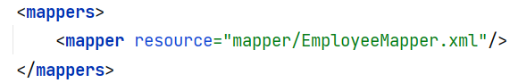

测试在SpringBoot 项目开发中的测试；

**主要用于测试MyBatis的Mapper.xml文件**，通过SQLSession进行测试；只需要提供pojo，和Mapper.xml文件就可以进行连接数据库测试MyBatis;

使用的配置文件都是XML的文件；

数据库为：

```mysql
DROP TABLE IF EXISTS t_employee; 
CREATE TABLE t_employee ( 
    id int(11) NOT NULL AUTO_INCREMENT,  
    name varchar(30) DEFAULT NULL,  
    age int(11) DEFAULT NULL,  
    birthday date DEFAULT NULL,  
    salary decimal(10,0) DEFAULT NULL,  
    PRIMARY KEY(id)
)
```

需要注意的是：当添加了新的测试Mapper.xml文件就需要在：



mybatis-config.xml文件中进行添加；


```
注释1:由于想多熟悉一下生成SqlSession那部分的代码,所以测试类的时候没有封装工具类.
注释2:有一个点需要注意,就是增删改的时候一定要提交事务,查询可以不提交,增删改一定不能忘,不然数据库中的值是不会改变的.
```

